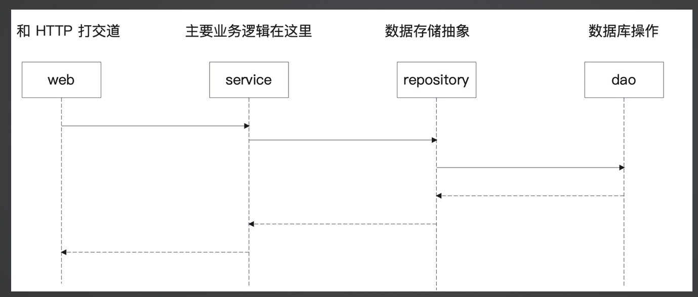
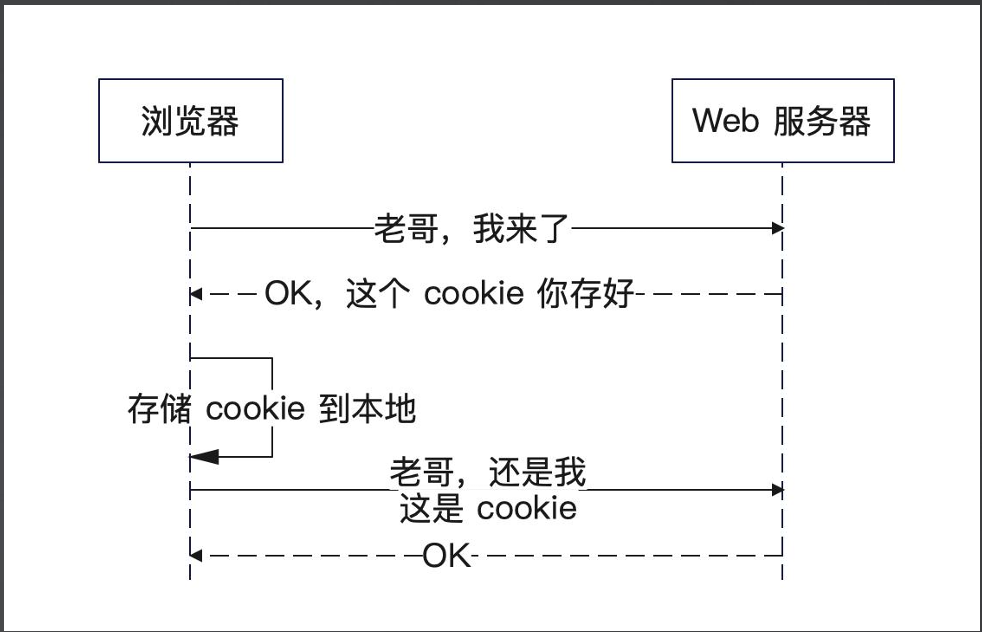
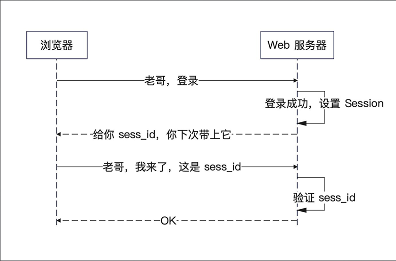
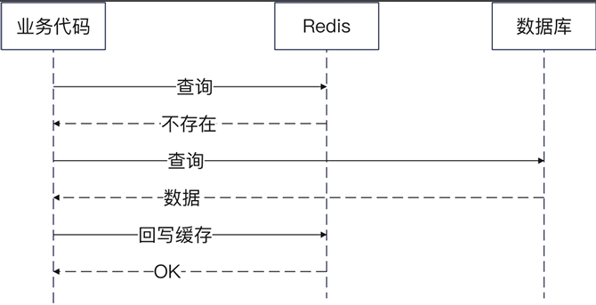

# go 八股项目——小微书（仿小红书）

## 分层结构

+ service: 代表的是领域服务（domain service），
  代表一个业务的完整的处理过程。
+ repository：按照 DDD 的说法，是代表领域对象的
  存储，这里你直观理解为存储数据的抽象。
+ dao: 代表的是数据库操作。
+ 还需要一个 domain，代表领域对象。

## 登录校验
### cookie 和 session
浏览器存储一些数据到本地，这些数据就是 Cookie
因为 Cookie 是放在浏览器本地的，所以很不安全

关键数据我们希望放在后端，这个存储的东西就叫做 Session
服务器要给浏览器一个 sess_id，也就是 Session 的ID，后续每一次请求都带上这个 Session ID，服务端就知道你是谁了

### 刷新登录状态
+ 定期刷新过期时间
  在`middleware`中`login`里刷新，根据业务设置`token`的过期时间，一定时间间隔刷新`token`。需要在`session`里面设置一个更新时间，根据更新时间和当前时间的差，超过时间间隔就刷新

### JWT校验
+ JWT的组成
  + Header：头部，JWT的元数据，也就是描述这个`token`本身的数据，一个 JSON 对象。
  + Payload：负载，数据内容，一个 JSON 对象。
  + Signature：签名，根据 header 和 token 生成。

go jwt 使用参考: https://learnku.com/articles/85927, https://github.com/golang-jwt/jwt

## 性能优化
### 引入缓存

## 短信验证码登录
### 短信服务(基础)
