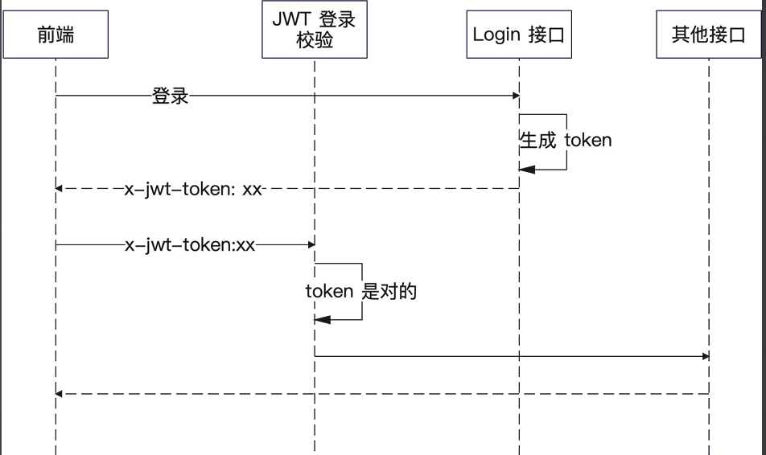
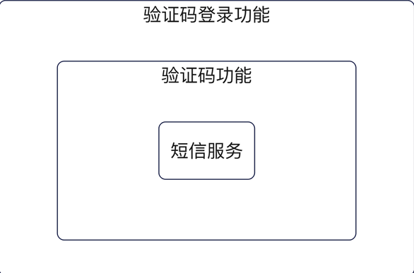
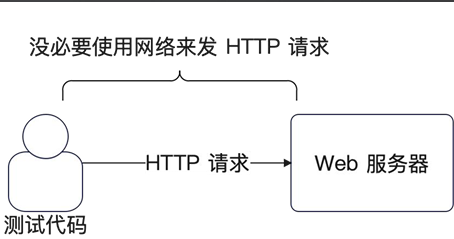

# go 八股项目——小微书（仿小红书）

## 分层结构

+ service: 代表的是领域服务（domain service），
  代表一个业务的完整的处理过程。
+ repository：按照 DDD 的说法，是代表领域对象的
  存储，这里你直观理解为存储数据的抽象。
+ dao: 代表的是数据库操作。
+ 还需要一个 domain，代表领域对象。

## 登录校验
### cookie 和 session
浏览器存储一些数据到本地，这些数据就是 Cookie
因为 Cookie 是放在浏览器本地的，所以很不安全


关键数据我们希望放在后端，这个存储的东西就叫做 Session
服务器要给浏览器一个 sess_id，也就是 Session 的ID，后续每一次请求都带上这个 Session ID，服务端就知道你是谁了


### 刷新登录状态
+ 定期刷新过期时间
  在`middleware`中`login`里刷新，根据业务设置`token`的过期时间，一定时间间隔刷新`token`。需要在`session`里面设置一个更新时间，根据更新时间和当前时间的差，超过时间间隔就刷新


### JWT校验
+ JWT的组成
  + Header：头部，JWT的元数据，也就是描述这个`token`本身的数据，一个 JSON 对象。
  + Payload：负载，数据内容，一个 JSON 对象。
  + Signature：签名，根据 header 和 token 生成。

go jwt 使用参考: https://learnku.com/articles/85927, https://github.com/golang-jwt/jwt


## 性能优化
### 引入缓存


## 短信验证码登录
### 服务划分

### 短信服务(基础)
根据不同的服务，试着抽象出接口，方便扩展


### 发送验证码


在分布式场景下，存在并发问题


可以利用redis的单线程特性解决这个问题


发送验证码实现流程


验证验证码流程


实现接口


引入手机号之后，一个表格里会有两个唯一索引(`email` 和 `phone`), mysql中允许唯一索引可以有多个`null`，但不能有多个`""`
在 Go 里面, 用 `sql.NullXXX` 这一家族类, 让 ORM 插入一个 `NULL` 值。

按照最严格的标准来说，我们其实需要一个 UserAggrService，即用户聚合服务，在这个服务里面完
成发送验证码和验证码登录的逻辑。


## 依赖注入
依赖注入，是指 A 依赖于 B，也就是 A 要调用 B 上的方法，那么 A 在初始化的时候就要求传入
一个构建好的 B。

### IoC：控制反转
依赖注入是控制反转的一种实现形式。

还有一种叫做依赖发现。比如说 A 调用 B，然后 A 自己去
找到可用的 B，那就是依赖发现。

控制反转的意思就是，UserHandler 不会去初始化 UserService。要么外面传入 UserService 给 UserHandler，这种叫做依赖注入；要么是 UserHandler 自己去找一个 UserService，这种叫做依赖查找。


要使用 `wire` 实现依赖注入，官方链接: https://github.com/google/wire?tab=readme-ov-file

## 单元测试
### 测试UserHandler
+ 构造http请求
  
  ```go
  req, err := http.NewRequest(http.MethodPost, "/users/signup", bytes.NewReader([]byte(`
  {
    "email": "123@qq.com",
    "password": "hello#world123",
    "confirmPassword": "hello#world123"
  }`)))
  ```
+ 获得 HTTP 响应

  

  传入一个可以存住数据的 `http.ResponseWriter`, 测试的时候，返回的响应实际上是写入到了
  这个特殊的 ResponseWriter 里面
  ```go
  recorder := httptest.NewRecorder()
  server.ServeHTTP(recorder, req)
  ```
+ 使用`mock`解决初始化需要的service接口
  命令: mockgen -source=./webook/internal/service/user.go -package=svcmocks -destination=./webook/internal/service/mocks/user.mock.go
  + source：也就是你接口所在的文件。
  + destination：也就是你生成代码的目标路径。
  + package：也就是生成代码的文件的 package。
  
  `mock` 使用
  